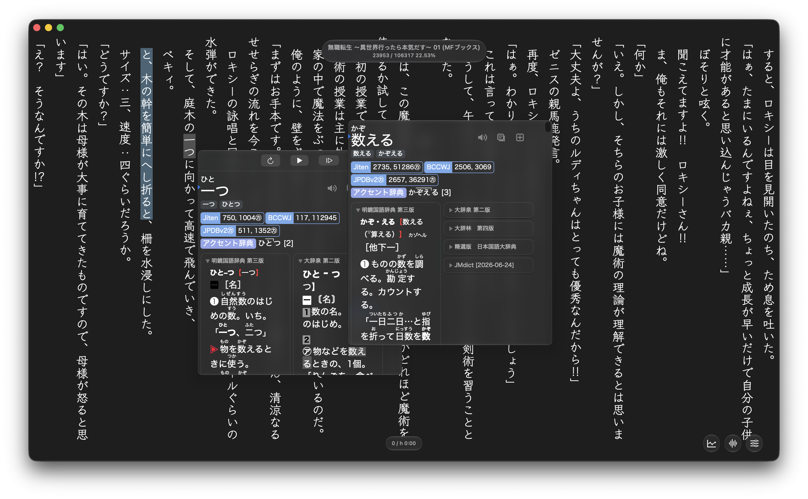
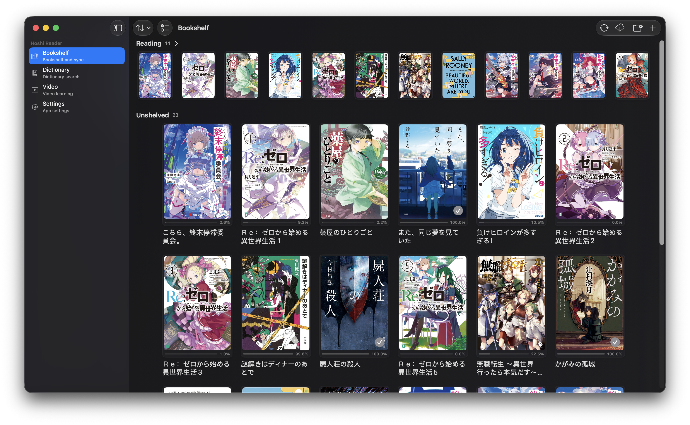
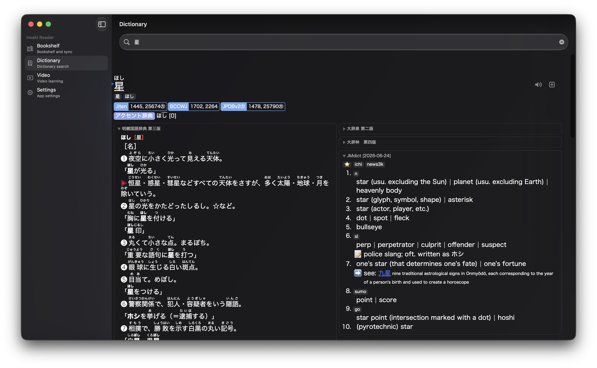
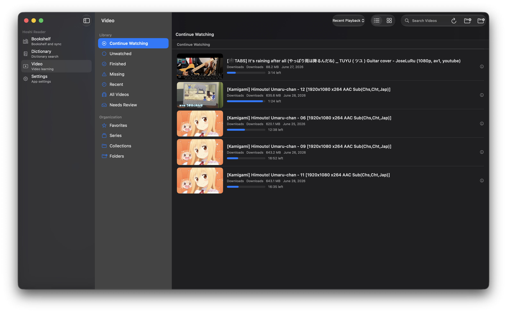
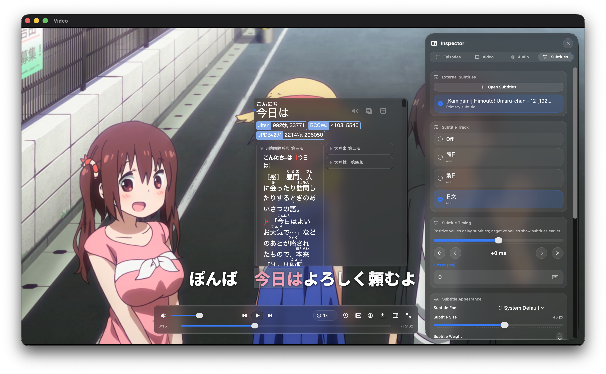

# Hoshi Reader Mac

[English](README.md) | [简体中文](README.zh-CN.md)

Hoshi Reader Mac is a Japanese immersion app for macOS that brings EPUB reading, Yomitan-style dictionary lookup, local subtitle-based video study, and AnkiConnect mining into one desktop workflow.

Releases provide two DMG variants: Light focuses on book reading, while Video adds a local video library, subtitle-aware playback, Transcript, and video mining.

    
    
    

    
    
    

## Features

### Book Reading

- EPUB bookshelf with import, sorting, and reading progress.
- Vertical / horizontal writing, paged / continuous reading, themes, fonts, and layout controls.
- Sasayaki audiobook playback, local word audio, and reading statistics.

### Dictionary Lookup

- Yomitan term, frequency, and pitch dictionary support.
- Click lookup, text-selection lookup, Shift-hover lookup, and nested lookup inside popups.
- Shared rendering between reader popups and the dictionary search page.

### Video Learning

- The Video variant adds a local video library with continue watching, search, filters, thumbnails, and playback history.
- A dedicated player window provides subtitle lookup, Transcript, chapters, Inspector, and Mining History.
- Supports common text subtitle sources, including embedded subtitles and SRT / VTT / ASS / SSA sidecars.

### Anki And Sync

- Mac card creation uses AnkiConnect, with duplicate checks and media fields.
- Book cards can include local word audio, Sasayaki audio, and book covers; video cards can include screenshots and subtitle audio clips.
- Optional Google Drive sync for books, progress, statistics, and related study data.

### Desktop Experience

- Native multi-window layout: main window, reader window, and video player window stay independent.
- Unified shortcuts, Profiles, settings, and release update checking.

## Why Hoshi Reader Mac

- Read, look up, listen, watch subtitle videos, and mine cards inside one desktop app.
- Books and videos share dictionaries, popups, Profiles, and the Anki pipeline.
- Light / Video releases let you install only what you need; the book reader package does not include video playback dependencies.
- Books, dictionaries, videos, and most study data stay local by default; sync and AnkiConnect are optional.

## Download

Download the latest macOS build from [GitHub Releases](https://github.com/W1ght/Hoshi-Reader-for-Mac/releases).

Hoshi Reader Mac is distributed as a `.dmg`. If macOS blocks the app, open it from Finder with right click > Open, or allow it in System Settings > Privacy & Security.

## Guides

- Book reading guide: [Hoshi Reader documentation](https://my.feishu.cn/wiki/SXzUw9F6AiPw99kdzwac5Cv8n0f)
- Japanese learning guide: [SLA-based Japanese learning guide](https://my.feishu.cn/wiki/YeOSwsG7giLuQxkcDFscUXVZn2f)

## Development Status

Hoshi Reader Mac is actively iterating on native macOS multi-window reading, video study, sync, and card creation. Official builds are published as DMGs on GitHub Releases, with user-visible changes described in release notes.

This repository targets the macOS app only. Light and Video are release configurations of the same native App target.

## Privacy And Data

- Local books, dictionaries, video files, and study data stay on the user's Mac by default.
- Google Drive sync requires explicit user authorization.
- Anki mining uses the AnkiConnect endpoint configured by the user.
- Update checking is used to open GitHub Releases.

## Feedback And Requests

Please use this repository's Issues for macOS reading, lookup, sync, video learning, or Anki mining problems. Include whether you are using the Light or Video build and your macOS version when possible.

## Attribution

- [Manhhao/Hoshi-Reader](https://github.com/Manhhao/Hoshi-Reader): the original Hoshi Reader project.
- [Hoshi Reader Android](https://github.com/HuangAntimony/Hoshi-Reader-Android): Android-native Japanese reader.
- [hoshidicts](https://github.com/Manhhao/hoshidicts): Hoshi dictionary data and format.
- [Yomitan](https://github.com/yomidevs/yomitan): an important reference for popup dictionary UX.
- [Ankiconnect Android](https://github.com/KamWithK/AnkiconnectAndroid): local audio and mining experience reference.
- [ッツ Ebook Reader](https://github.com/ttu-ttu/ebook-reader): reading statistics and reading experience reference.
- [EPUBKit](https://github.com/witekbobrowski/EPUBKit): EPUB parsing.
- [TheMoeWay](https://learnjapanese.moe/): Japanese immersion learning resources.
- [星街すいせい (Hoshimachi Suisei)](https://www.youtube.com/@HoshimachiSuisei): inspiration for the project name (星読み).

## License

Distributed under the GNU General Public License v3.0. See [LICENSE](LICENSE) for more information.
