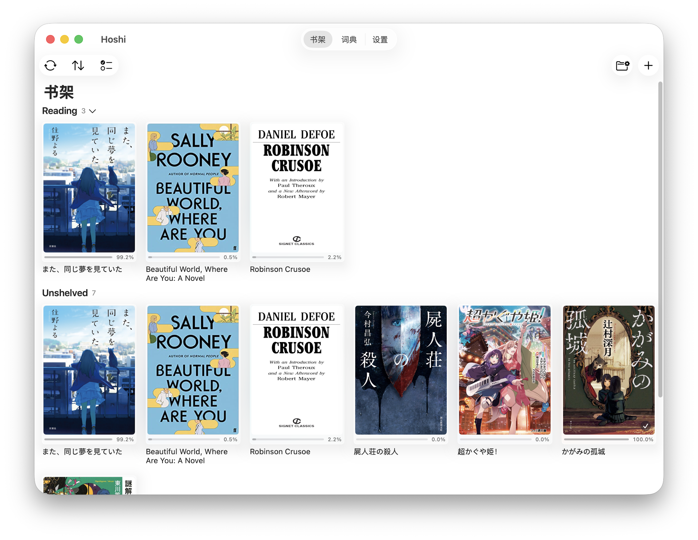
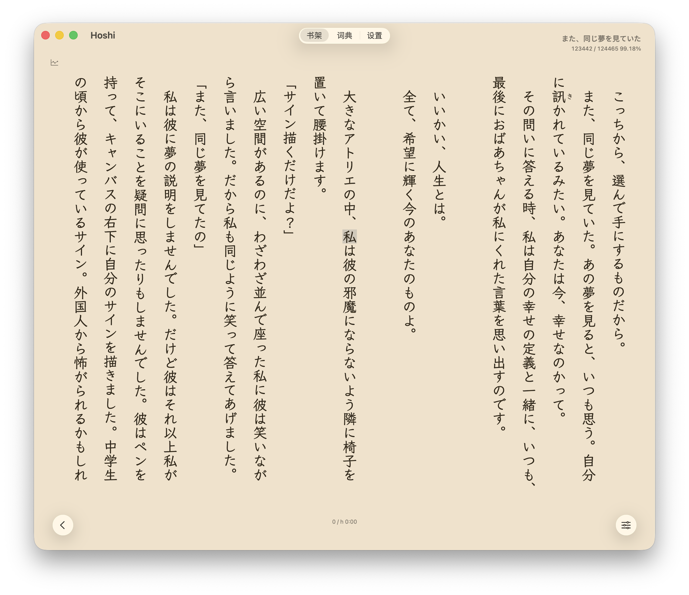
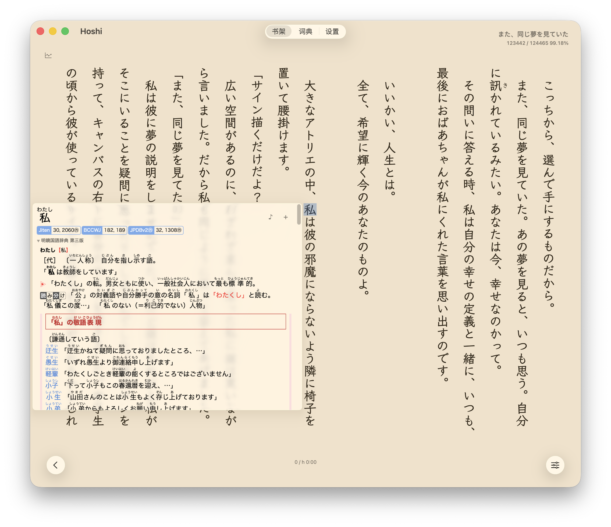
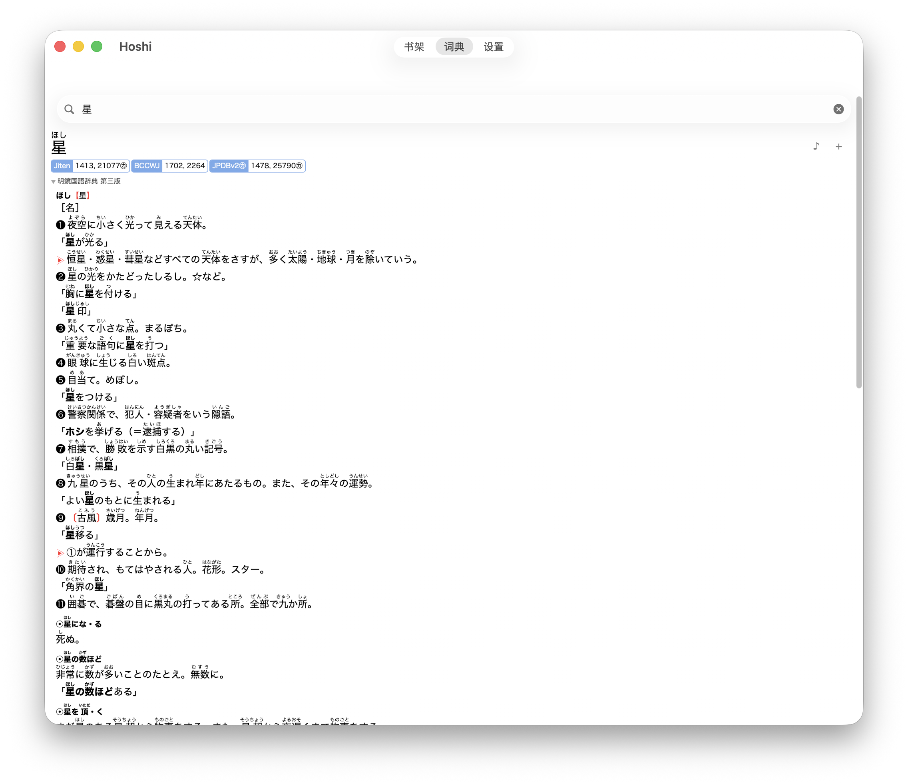
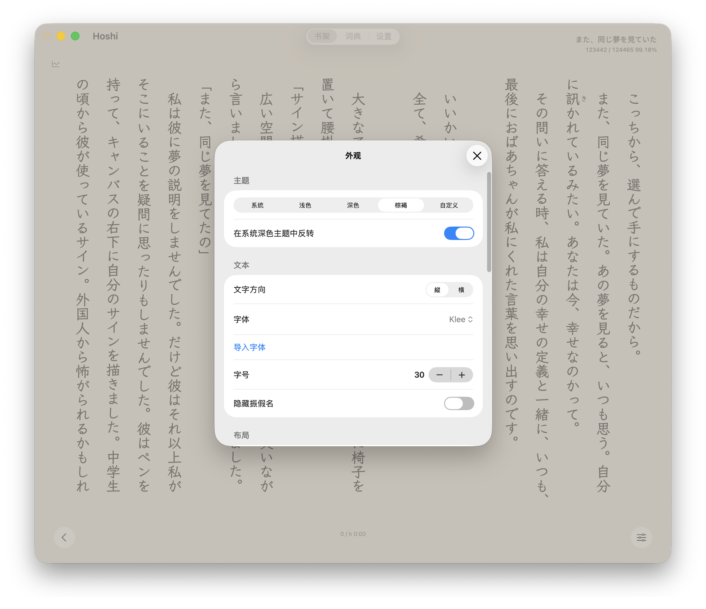
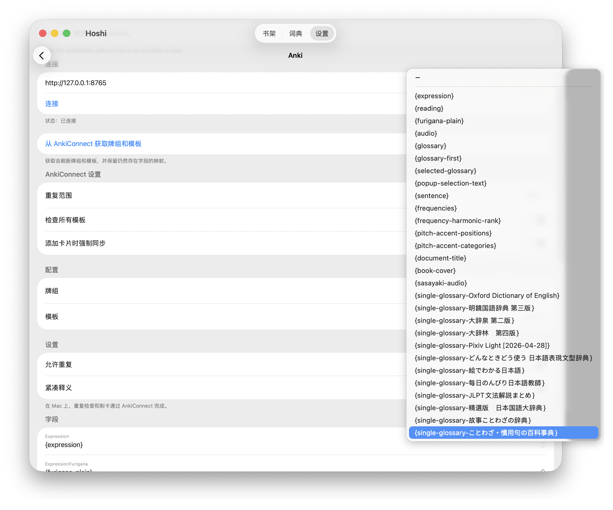

<div align="center">

# Hoshi Reader Mac

[English](README.md) | [简体中文](README.zh-CN.md)


Hoshi Reader Mac 是一款轻量级日语 EPUB 阅读器，支持 Yomitan 词典，面向 macOS 桌面端沉浸式学习场景。

这个 Mac 版本保留了原 Hoshi Reader 的阅读、查词、音频、同步和制卡体验，同时加入了更适合桌面使用的交互方式、AnkiConnect、键盘快捷键、本地音频和 DMG 发布流程。

<p align="center">
    
    
    
</p>
<p align="center">
    
    
    
</p>

## 下载

从 [GitHub Releases](https://github.com/W1ght/Hoshi-Reader-for-Mac/releases) 下载最新 macOS 版本。

Hoshi Reader Mac 以 `.dmg` 形式发布。如果 macOS 提示未验证开发者而阻止打开，请在 Finder 中右键应用并选择“打开”，或在系统设置 > 隐私与安全性中允许打开。

应用也在书架页提供更新检查入口，不需要手动去 Release 页面查找最新版本。

## 功能

<div align="left">

- 支持 **竖排**（縦書き）和横排（横書き）EPUB 阅读
- 桌面端书架布局，支持阅读进度、排序、导入和书库管理
- 类 Yomitan 弹窗词典，支持**活用还原**
- 支持 Yomitan 术语词典、频率词典和音高词典
- 词典搜索页与阅读器弹窗共用同一套渲染引擎
- 支持点击查词、文本选择，以及弹窗内嵌套查词
- Mac 悬浮查词：鼠标悬浮到词上并按 `Shift`，即可从指针位置开始扫描
- 可配置翻页和 Sasayaki 播放相关键盘快捷键
- 支持本地音频数据库，用于离线单词发音
- 支持 Sasayaki 有声书：音频匹配、句子高亮、播放/暂停和跳句
- Mac 端通过 AnkiConnect 制卡，支持重复检查、媒体字段、本地单词音频和 Sasayaki 音频字段
- 制卡结果以顶部气泡提示，不打断阅读
- 支持阅读统计和 ッツ Reader 兼容同步
- 支持通过 Google Drive 同步书籍、进度、统计和音频相关阅读数据
- 支持自定义主题、字体、垂直间距、阅读器控制栏，以及词典原生 CSS
- Sasayaki 高亮支持亮色/暗色主题分别设置颜色

</div>

</div>

## Mac 交互

Hoshi Reader Mac 仍然基于 Hoshi Reader 的共享代码，但 Mac 版本增加了一些桌面端交互：

- 使用应用时，顶部始终提供 `Books`、`Dictionary` 和 `Settings` 导航入口。
- 阅读器内可使用 `Esc` 和 `Cmd+W` 返回书架。
- 全屏阅读时会隐藏顶部导航，鼠标移动到屏幕顶部时再显示。
- 不使用触控板滑动手势翻页，避免误触 macOS 返回导航。
- 分页和连续阅读都会适配 Mac Catalyst 安全区域和窗口缩放。

实现细节见 [docs/mac-catalyst-interactions.md](docs/mac-catalyst-interactions.md)。

## Mac 上的 Anki

macOS 上的制卡使用 [AnkiConnect](https://ankiweb.net/shared/info/2055492159)，不使用 iOS 的 AnkiMobile 回调流程。

1. 安装 Anki 和 AnkiConnect 插件。
2. 在同一台 Mac 上启动 Anki。
3. 打开 Hoshi Reader > Settings > Anki。
4. 连接 `http://127.0.0.1:8765`。
5. 从 AnkiConnect 获取牌组和模板，然后配置字段映射。

Hoshi Reader 会自动重试 AnkiConnect 连接，所以即使先打开 Hoshi、后打开 Anki，也会在 Anki 启动后自动恢复连接。

## 键盘快捷键

键盘快捷键可在 Settings > Advanced > Keyboard Shortcuts 中配置。

| 操作 | 默认快捷键 |
| :--- | :--- |
| 上一页 | `←` |
| 下一页 | `→` |
| 上一句 Sasayaki | `[` |
| 播放 / 暂停 Sasayaki | `P` |
| 下一句 Sasayaki | `]` |
| 关闭阅读器 | `Esc` / `Cmd+W` |
| 专注模式 | `F` |

点击某个快捷键配置项后，按下单个按键或组合键即可录入。

## 本地音频与 Sasayaki

Hoshi Reader Mac 可以使用本地音频数据库播放单词发音。前往 Settings > Advanced > Audio 启用 Local Audio，然后导入兼容 Ankiconnect Android 本地音频格式的 `android.db`。

Sasayaki 用于整本有声书播放。在阅读器的 Sasayaki 面板中导入本地有声书音频和匹配的 cue 数据后，就可以通过阅读器控制栏或键盘快捷键播放、暂停和跳句。

## 词典 CSS

自定义 CSS 会作为原生 CSS 注入词典 WebView，并且在词典内容渲染后生效。Hoshi Reader 不会改写不受支持的 CSS 属性。如果某些属性在 Mac Catalyst 的 `WKWebView` 中表现不稳定，建议使用明确选择器直接调整样式，例如：

```css
[data-dictionary="明鏡国語辞典 第三版"] .glossary-content {
    font-size: 18px;
    line-height: 1.65;
}

.dict-label {
    font-size: 11px;
}
```

## 开发

1. 克隆仓库。
2. 使用 Xcode 打开 `Hoshi Reader.xcodeproj`。
3. 选择 `Hoshi Reader` scheme，并以 Mac Catalyst 目标构建。

本地构建和启动脚本：

```bash
./script/build_and_run.sh
```

无签名构建验证：

```bash
xcodebuild -quiet -project 'Hoshi Reader.xcodeproj' -scheme 'Hoshi Reader' -destination 'generic/platform=macOS,variant=Mac Catalyst' CODE_SIGNING_ALLOWED=NO CODE_SIGNING_REQUIRED=NO build
```

Release 由 GitHub Actions 根据 tag 自动构建，并发布 DMG 产物。

## 与原项目的关系

本仓库是基于原项目 [Manhhao/Hoshi-Reader](https://github.com/Manhhao/Hoshi-Reader) 的独立 Mac 版本分支。

目标是在保留 Hoshi Reader iOS 阅读模型和词典管线的基础上，让它成为一个更适合 macOS 日常使用的桌面阅读器。

## 依赖库

| 名称 | License |
| :--- | :--- |
| [hoshidicts](https://github.com/Manhhao/hoshidicts) | GPLv3 |
| [EPUBKit](https://github.com/witekbobrowski/EPUBKit) | MIT |
| [SwiftUI Introspect](https://github.com/siteline/swiftui-introspect) | MIT |

## 归属与引用

| 名称 | 说明 | License |
| :--- | :--- | :--- |
| [Hoshi Reader](https://github.com/Manhhao/Hoshi-Reader) | 本 Mac 版本基于的原项目 | GPLv3 |
| [Ankiconnect Android](https://github.com/KamWithK/AnkiconnectAndroid) | Local Audio 实现 | GPLv3 |
| [Yomitan](https://github.com/yomidevs/yomitan) | 弹窗词典中的多处代码来源 | GPLv3 |
| [ッツ Ebook Reader](https://github.com/ttu-ttu/ebook-reader) | 阅读统计 | BSD-3 |
| [JMdict for Yomitan](https://github.com/yomidevs/jmdict-yomitan) | 推荐术语词典 | CC-BY-SA-4.0 |
| [Jiten](https://github.com/Sirush/Jiten) | 推荐频率词典 | Apache-2.0 |
| [Kanji alive](https://github.com/kanjialive/kanji-data-media) | 默认音频源 | CC-BY-4.0 |
| [Tofugu/WaniKani Audio](https://github.com/tofugu/japanese-vocabulary-pronunciation-audio) | 默认音频源 | CC-BY-SA-4.0 |

## 特别感谢

* **[Manhhao/Hoshi-Reader](https://github.com/Manhhao/Hoshi-Reader)** - 感谢原 Hoshi Reader 项目和作者提供了这个 Mac 版本赖以构建的基础。
* **[TheMoeWay](https://learnjapanese.moe/)** - 让沉浸式日语学习变得更容易开始。
* **[Yomitan](https://github.com/yomidevs/yomitan)** - 作为非常重要的工具，也是弹窗词典的主要灵感来源。
* **[Ankiconnect Android](https://github.com/KamWithK/AnkiconnectAndroid)** - 提供了优秀的制卡和本地音频体验。
* **[ッツ Ebook Reader](https://github.com/ttu-ttu/ebook-reader)** - 启发了核心阅读体验。
* **[星街すいせい (Hoshimachi Suisei)](https://www.youtube.com/@HoshimachiSuisei)** - 启发了项目名称（星読み）。

## License

本项目基于 GNU General Public License v3.0 发布。更多信息请查看 [LICENSE](LICENSE)。
