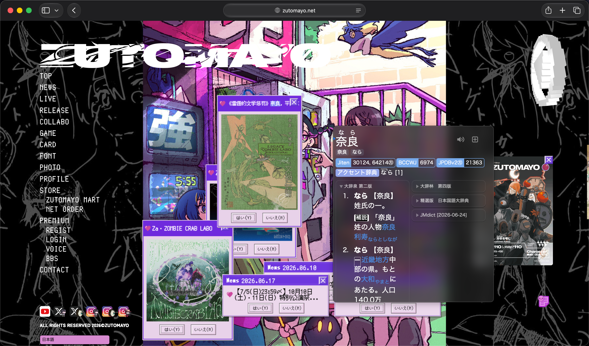
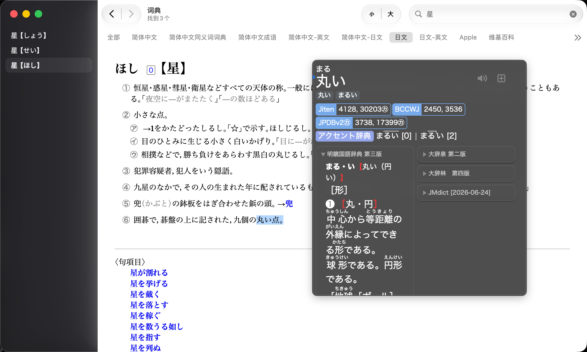
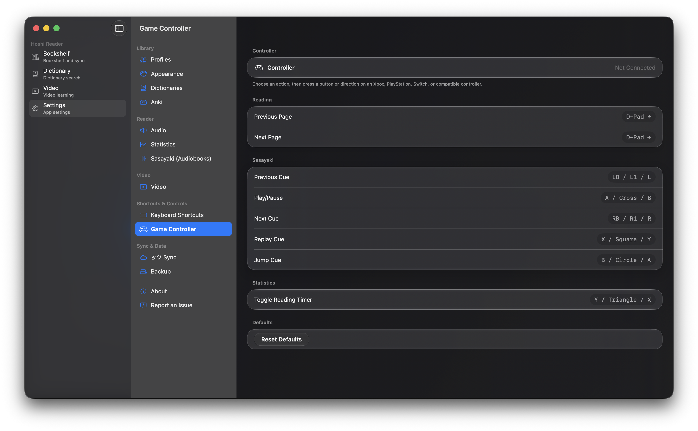

# Niratan

[English](README.md) | [简体中文](README.zh-CN.md)

Niratan 是面向 macOS 的日语沉浸式学习应用，把 EPUB 阅读、Yomitan 风格查词、本地视频字幕学习和 AnkiConnect 制卡放在同一个桌面工作流里。

当前发布提供 Light 和 Video 两种 DMG：Light 专注小说阅读；Video 在此基础上加入本地视频库、字幕播放器、Transcript 和视频制卡。

    
    
    

    
    
    

    
    
    

## 功能

### 小说阅读

- EPUB 书架、导入、排序和阅读进度管理。
- 支持竖排 / 横排、分页 / 连续滚动、主题、字体和排版调整。
- 支持 Sasayaki 有声书、本地单词音频和阅读统计。

### 查词与词典

- 支持 Yomitan 术语词典、频率词典和音高词典。
- 支持点击查词、文本选择查词、Shift 悬浮查词和弹窗内嵌套查词。
- 支持可选的跨 App 全局查词：配置快捷键并授权辅助功能后，可在网页、PDF 或其他 App 中对选中文本呼出当前 Profile 的 Hoshi 查词弹窗。
- 阅读器弹窗和词典搜索页复用同一套词典渲染。

### 视频学习

- Video 版本支持本地视频库、继续观看、搜索、筛选、缩略图和播放历史。
- 独立播放器窗口支持字幕查词、Transcript、章节、Inspector 和 Mining History。
- 支持常见文本字幕来源，包括内嵌字幕和 SRT / VTT / ASS / SSA 外挂字幕。

### Anki 制卡与同步

- Mac 端通过 AnkiConnect 制卡，支持重复检查和媒体字段。
- 小说可附带本地单词音频、Sasayaki 音频和书籍封面；视频可附带截图和字幕音频片段。
- 可选 Google Drive 同步书籍、阅读进度、统计和相关学习数据。

### 桌面体验

- 原生多窗口布局：主窗口、阅读窗口和视频播放器窗口相互独立。
- 统一的快捷键设置、Profile、设置页和更新检查入口。

## 为什么选择 Niratan

- 阅读、查词、听书、看字幕视频和制卡在一个桌面应用里完成。
- 小说和视频共用词典、弹窗、Profile 和 Anki 管线，减少重复配置。
- Light / Video 双发布包可以按需安装，小说阅读包不会携带视频播放依赖。
- 书籍、词典、视频和大部分学习数据都保留在本机；同步和 AnkiConnect 都是可选能力。

## 下载

从 [GitHub Releases](https://github.com/W1ght/Niratan/releases) 下载最新 macOS 版本。

Niratan 以 `.dmg` 形式发布。如果 macOS 阻止打开，请在 Finder 中右键应用并选择“打开”，或在系统设置 > 隐私与安全性中允许打开。

## 使用指南

- 阅读模块可参考：[Hoshi Reader 使用文档](https://my.feishu.cn/wiki/SXzUw9F6AiPw99kdzwac5Cv8n0f)
- 日语学习方法可参考：[基于二语习得理论的日语学习指南](https://my.feishu.cn/wiki/YeOSwsG7giLuQxkcDFscUXVZn2f)

## 开发状态

Niratan 当前围绕原生 macOS 多窗口阅读、视频学习、同步和制卡体验持续迭代。正式发布以 GitHub Releases 中的 DMG 为准，用户可见变化会记录在 release notes 中。

本仓库只面向 macOS App；Light 和 Video 使用同一个原生 App target 的不同发布配置。

## 隐私与数据

- 本地书籍、词典、视频文件和学习数据默认保存在用户本机。
- Google Drive 同步需要用户显式登录授权。
- Anki 制卡通过用户本机配置的 AnkiConnect 地址完成。
- 更新检查只用于跳转到 GitHub Releases。

## 反馈与功能请求

如果你在 macOS 阅读、查词、同步、视频学习或 Anki 制卡中遇到问题，欢迎通过本仓库的 Issues 反馈。请尽量说明使用的是 Light 还是 Video 版本，以及对应的 macOS 版本。

## 鸣谢

- [Manhhao/Hoshi-Reader](https://github.com/Manhhao/Hoshi-Reader)：原 Hoshi Reader 项目。
- [Hoshi Reader Android](https://github.com/HuangAntimony/Hoshi-Reader-Android)：Android 原生日语阅读器。
- [hoshidicts](https://github.com/Manhhao/hoshidicts)：Hoshi 词典数据与格式。
- [Yomitan](https://github.com/yomidevs/yomitan)：弹窗词典体验的重要参考。
- [Ankiconnect Android](https://github.com/KamWithK/AnkiconnectAndroid)：本地音频与制卡体验参考。
- [ッツ Ebook Reader](https://github.com/ttu-ttu/ebook-reader)：阅读统计与阅读体验参考。
- [EPUBKit](https://github.com/witekbobrowski/EPUBKit)：EPUB 解析。
- [TheMoeWay](https://learnjapanese.moe/)：日语沉浸学习资源。
- [星街すいせい (Hoshimachi Suisei)](https://www.youtube.com/@HoshimachiSuisei)：项目名称灵感来源（星読み）。

## 许可证

本项目基于 GNU General Public License v3.0 发布。更多信息请查看 [LICENSE](LICENSE)。
